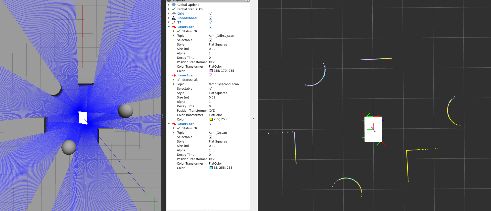
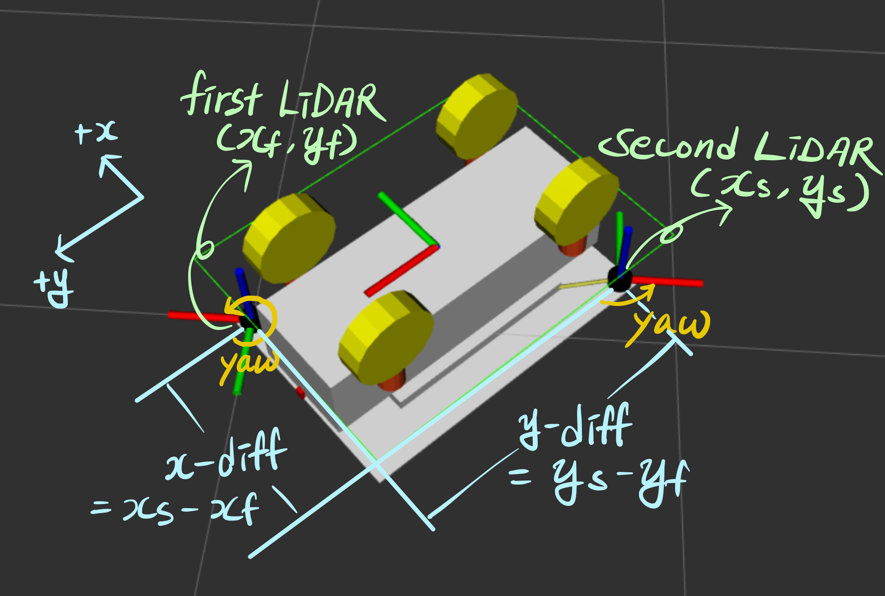

# ros2_lidar_merge



This ROS 2 package merges two LaserScan messages from two 2D LiDARs into a single LaserScan message. 

The package has been tested on ROS 2 Humble.

## Requisites

You need to have two LiDARs that are installed in same z direction (Both upward or both downward).


## Installation
Clone this repository into your ROS2 workspace:
```bash
cd /path/to/workspace/src
git clone https://github.com/lineworld-lab/ros2_lidar_merger.git
mv ros2_lidar_merger lidar_merger
```

Build:

```bash
cd /path/to/workspace
colcon build
```

## Usage

Command line example:

```bash
ros2 run lidar_merger lidar_merger --ros-args -p first_lidar_yaw:=-0.785 -p second_lidar_yaw:=2.356 -p x_diff:=-0.49 -p y_diff:=-0.74 -r __ns:=/amr_1
```
<br>

Launch file example:
```Python
  lidar_merger = Node(
    package="lidar_merger",
    executable="lidar_merger",
    namespace=namespace,
    parameters=[
        {"first_lidar_yaw": -1.0 / 4.0 * PI},
        {"second_lidar_yaw": 3.0 / 4.0 * PI},
        {"x_diff": -0.49},
        {"y_diff": -0.74},
    ],
    output="screen"
)
```


## Parameters


The lidar merger node has the following parameters:

- `first_lidar_yaw`: The yaw angle of the first LiDAR relative to the robot's heading.
- `second_lidar_yaw`: The yaw angle of the second LiDAR relative to the robot's heading.
- `x_diff`: The distance between the second LiDAR and the first LiDAR in a coordinate system where the +y axis indicates the robot's heading.
- `y_diff`: The distance between the second LiDAR and the first LiDAR in a coordinate system where the +y axis indicates the robot's heading.

## License

This project is licensed under the [MIT License](LICENSE).
